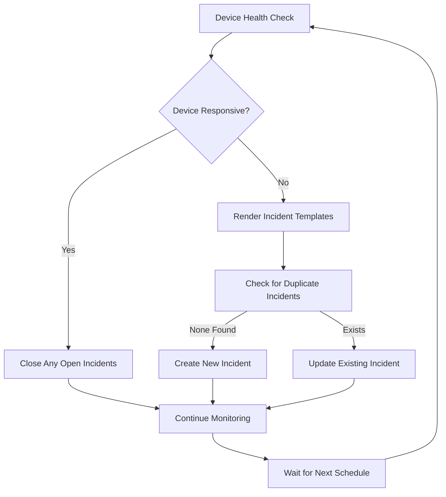

# Ansible ServiceNow Network Monitoring Integration

Automated network device monitoring with ServiceNow incident lifecycle management and systemd-based scheduling.

## Overview

This project provides a comprehensive solution for monitoring network infrastructure and automatically creating/managing ServiceNow incidents when issues are detected. It uses a factory pattern for automatic role discovery and systemd timers for reliable scheduling.

## Features

- **Automatic Device Monitoring**: Continuous health checks for network devices
- **ServiceNow Integration**: Automatic incident creation, updates, and closure
- **Role Discovery Factory**: Automatically discovers and schedules monitoring roles
- **Systemd Scheduling**: Reliable, persistent timer-based execution
- **Template-Based**: Jinja2 templates for flexible incident content
- **Duplicate Prevention**: Correlation-based incident deduplication
- **CMDB Integration**: Automatic Configuration Item (CI) association

## Quick Setup

1. **Copy and configure vault file:**
   ```bash
   cp group_vars/all/vault.yml.example group_vars/all/vault.yml
   # Edit vault.yml with your ServiceNow credentials
   ansible-vault encrypt group_vars/all/vault.yml
   ```

2. **Install dependencies:**
   ```bash
   ansible-galaxy collection install servicenow.itsm cisco.ios community.general
   ```

3. **Run tests:**
   ```bash
   cd tests
   ansible-playbook test_servicenow.yml
   ansible-playbook test_interface.yml
   ```

## Architecture

### Core Components

```
ansible-servicenow/
├── roles/
│   ├── device_uptime/          # Network device monitoring role
│   ├── interface_monitoring/   # Interface status monitoring role
│   ├── config_backup/          # Configuration backup role
│   ├── device_log_collection/  # Device log collection role
│   └── servicenow_itsm/        # ServiceNow API wrapper role
├── scheduler/                  # Automated scheduling system
│   ├── scheduler.py            # Main orchestrator
│   ├── scheduler_factory.py    # Role discovery factory
│   └── templates/              # Systemd service templates
├── playbooks/                  # Production playbooks
├── inventory/                  # Inventory examples and structure
├── tests/                      # Comprehensive test suite
│   ├── run_tests.sh           # Test runner script
│   └── README.md              # Test documentation
└── documentation/              # Additional documentation
```

### Design Patterns

1. **Factory Pattern**: Automatic role discovery and service generation
2. **Template Pattern**: Jinja2 templates for dynamic content generation
3. **Wrapper Pattern**: ServiceNow ITSM role abstracts API complexity
4. **Strategy Pattern**: Different monitoring strategies per device type

## Monitoring Roles

### How Monitoring Roles Work

Monitoring roles follow a standardized pattern:

1. **Health Check**: Execute monitoring logic (ping, SNMP, API calls)
2. **Template Rendering**: Generate incident content from Jinja2 templates
3. **ServiceNow Integration**: Call the ServiceNow ITSM wrapper role
4. **Lifecycle Management**: Handle incident creation, updates, and closure

### Existing Monitoring Roles

#### `device_uptime`
- **Purpose**: Network device connectivity monitoring
- **Schedule**: Every 5 minutes
- **Health Check**: ICMP ping with timeout
- **Incident Type**: Connectivity failures
- **Recovery**: Automatic incident closure when device responds

### Creating New Monitoring Roles

See [Creating New Monitoring Roles Guide](documentation/CREATE_NEW_ROLE.md) for detailed step-by-step instructions.

For a complete example of creating a new monitoring role, see the [Role Creation Guide](documentation/CREATE_NEW_ROLE.md) which includes:
- Step-by-step setup instructions
- Complete code examples with templates
- Best practices and naming conventions  
- Integration with the scheduler factory

## ServiceNow ITSM Integration

The `servicenow_itsm` role provides unified access to ServiceNow ITSM objects including incidents, change requests, and problem records. It features:

- **Multi-object support**: Incidents, changes, and problems
- **Field validation**: Required field checking with clear error messages
- **Duplicate prevention**: Correlation-based deduplication
- **CI association**: Automatic Configuration Item linking
- **Template integration**: Works with Jinja2 template rendering

### Quick Examples

**Create Incident:**
```yaml
- include_role: { name: servicenow_itsm }
  vars:
    itsm_type: incident
    incident_caller: "admin"
    incident_short_description: "Device connectivity failure"
```

**Create Change Request:**
```yaml
- include_role: { name: servicenow_itsm }
  vars:
    itsm_type: change
    change_type: normal
    change_short_description: "Network maintenance"
    change_description: "Scheduled firmware upgrade"
```

For complete field requirements, examples, and configuration details, see the [ServiceNow Integration Guide](documentation/SERVICENOW_INTEGRATION.md).

## Automated Scheduling System

The project includes a sophisticated factory-based scheduler that automatically discovers monitoring roles and creates systemd timers for production deployment.

### Key Features
- **Automatic Discovery**: Finds all monitoring-enabled roles
- **Systemd Integration**: Generates production-ready service files
- **Security Hardening**: Isolated execution with minimal privileges
- **Status Monitoring**: Real-time service status and logging

### Quick Usage
```bash
cd scheduler/
python3 scheduler.py discover          # Find monitoring roles
python3 scheduler.py create-timers     # Deploy to production  
python3 scheduler.py status            # Check service health
```

For complete scheduler documentation including architecture, configuration, and troubleshooting, see: [Scheduler Documentation](scheduler/README.md)

## Configuration

### Inventory Setup
Configure your network devices with proper asset tags for ServiceNow CI association:

```yaml
# inventory/production.yml.example
core-sw-01:
  ansible_host: 10.1.1.1
  device_asset_tag: "P1000002"  # Links to ServiceNow CI
  device_location: "Datacenter A"
```

## Required Vault Variables

Configure these in `group_vars/all/vault.yml`:

- `vault_servicenow_host` - Your ServiceNow instance URL
- `vault_servicenow_username` - ServiceNow API username  
- `vault_servicenow_password` - ServiceNow API password
- `vault_servicenow_default_caller` - Default incident caller
- `vault_servicenow_default_assignment_group` - Default assignment group

For complete configuration details, see the [ServiceNow Integration Guide](documentation/SERVICENOW_INTEGRATION.md).

## How It Works

### Device Monitoring Lifecycle



### Template-Based Content Generation

1. **Health Check Role** renders Jinja2 templates with monitoring data
2. **ServiceNow Role** receives pre-rendered content strings
3. **Templates** contain device-specific information and context
4. **Consistency** across incident creation and closure

### Duplicate Prevention

The system prevents duplicate incidents using correlation IDs:

- **Incident**: `device_connectivity_{{ inventory_hostname }}`
- **Change**: `device_maintenance_{{ inventory_hostname }}`
- **Problem**: `device_recurring_{{ inventory_hostname }}`

ServiceNow stores these correlation IDs and the system queries for existing records before creating new ones.

## Testing

Comprehensive test suite available in the `tests/` directory.

### Quick Testing
```bash
cd tests/

# Run specific tests
./run_tests.sh connectivity          # Basic connectivity (no ServiceNow)
./run_tests.sh validation-error     # Test field validation
./run_tests.sh incident-lifecycle   # Complete incident workflow

# Run all tests
./run_tests.sh all
```

### Test Categories
- **Basic Tests**: Connectivity and ServiceNow integration
- **Incident Tests**: Creation, closure, and lifecycle management
- **ITSM Tests**: Change requests and problem records  
- **Integration Tests**: Asset tag association and validation

See [tests/README.md](tests/README.md) for complete test documentation.

## Production Deployment

### Prerequisites

1. **System Requirements**:
   - Python 3.8+
   - Ansible 2.9+
   - ServiceNow ITSM Collection
   - systemd (for scheduling)

2. **ServiceNow Setup**:
   - Valid ServiceNow instance
   - User account with ITSM permissions
   - Configuration Items (CIs) for your devices

### Installation

1. **Clone and setup**:
```bash
git clone <repository>
cd ansible-servicenow
pip3 install -r requirements.txt
ansible-galaxy collection install servicenow.itsm
```

2. **Configure credentials**:
```bash
cp group_vars/all/vault.yml.example group_vars/all/vault.yml
# Edit with your ServiceNow credentials
ansible-vault encrypt group_vars/all/vault.yml
```

3. **Setup inventory**:
```bash
cp inventory/production.yml.example inventory/production.yml
# Configure your devices
```

4. **Deploy monitoring**:
```bash
# Test configuration
python3 scheduler/scheduler.py create-timers --dry-run

# Deploy to production
sudo python3 scheduler/scheduler.py create-timers
```

### Monitoring and Maintenance

1. **Check service status**:
```bash
python3 scheduler/scheduler.py status
systemctl status device-uptime-monitor.timer
```

2. **View logs**:
```bash
tail -f /var/log/ansible-monitoring/device-uptime-monitor.log
journalctl -u device-uptime-monitor.service -f
```

3. **Update schedules**:
   - Modify role `defaults/main.yml`
   - Run `sudo python3 scheduler.py create-timers` to update

## Documentation

- [Creating New Monitoring Roles](documentation/CREATE_NEW_ROLE.md)
- [ServiceNow Integration Guide](documentation/SERVICENOW_INTEGRATION.md)
- [Scheduler Documentation](scheduler/README.md)
- [Template Development Guide](documentation/TEMPLATES.md)
- [Troubleshooting Guide](documentation/TROUBLESHOOTING.md)

## Security Considerations

- **Credential Management**: All passwords encrypted with ansible-vault
- **Service Isolation**: systemd services run with minimal privileges
- **Network Security**: API calls over HTTPS only
- **Access Control**: ServiceNow API user with minimal required permissions
- **Audit Logging**: All operations logged for compliance

## Contributing

1. Fork the repository
2. Create a feature branch
3. Add monitoring role following the established patterns
4. Update documentation
5. Submit a pull request

## License

This project is licensed under the MIT License.

## Support

For questions and support:
- Review the [Troubleshooting Guide](documentation/TROUBLESHOOTING.md)
- Check project issues for known problems
- Create a new issue with detailed information

## Changelog

See git commit history for version updates and changes.