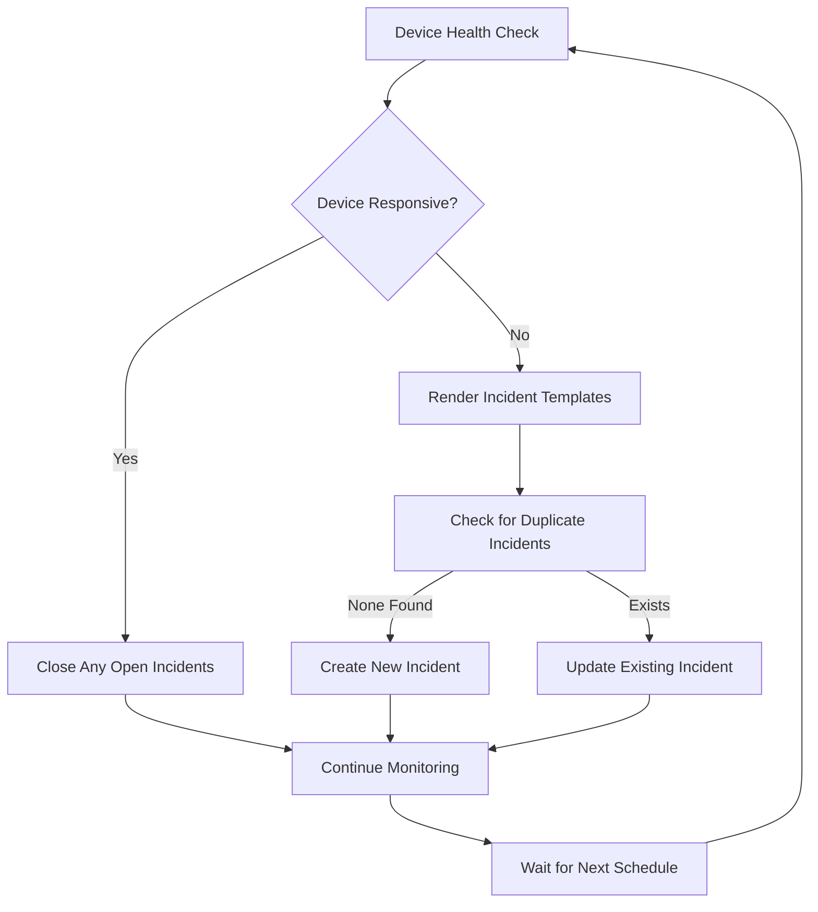

# Ansible ServiceNow ITSM Automation Toolkit

Automated network device monitoring with ServiceNow incident lifecycle management.

## Overview

This toolkit provides network infrastructure monitoring that automatically creates and manages ServiceNow incidents when issues are detected. It includes monitoring roles for device connectivity, interface status, and configuration backup with template-based incident creation.

## Features

- **Network Device Monitoring**: Device uptime, interface status, and configuration backup
- **ServiceNow ITSM Integration**: Automatic incident, change request, and problem record management
- **Template-Based Content**: Jinja2 templates for consistent incident descriptions
- **Duplicate Prevention**: Correlation-based incident deduplication
- **CMDB Integration**: Automatic Configuration Item (CI) association
- **Inventory Organization**: OS-based device grouping with proper connection handling

## Quick Setup

1. **Install dependencies:**
   ```bash
   ansible-galaxy collection install servicenow.itsm cisco.ios community.general
   ```

2. **Configure credentials:**
   ```bash
   cp group_vars/all/vault.yml.example group_vars/all/vault.yml
   # Edit vault.yml with your ServiceNow credentials
   ansible-vault encrypt group_vars/all/vault.yml
   ```

3. **Setup inventory:**
   ```bash
   cp inventory/production.yml.example inventory/production.yml
   cp inventory/group_vars/all.yml.example inventory/group_vars/all.yml
   # Configure your devices and connection settings
   ```

4. **Run tests:**
   ```bash
   ansible-playbook tests/test_device_uptime_role.yml
   ansible-playbook tests/test_itsm_incidents.yml
   ```

## Architecture

### Project Structure

```
ansible-servicenow/
├── roles/
│   ├── device_uptime/          # Network device connectivity monitoring
│   ├── interface_monitoring/   # Interface status monitoring
│   ├── config_backup/          # Configuration backup with failure detection
│   └── servicenow_itsm/        # ServiceNow API wrapper role
├── inventory/                  # OS-based device organization
│   ├── group_vars/            # Connection settings per device type
│   └── host_vars/             # Device-specific operational data
├── playbooks/                 # Production monitoring playbooks
├── tests/                     # Comprehensive test suite
├── scheduler/                 # Automated systemd-based scheduling system
└── documentation/             # Detailed guides and references
```

### Design Patterns

- **Template Pattern**: Jinja2 templates for dynamic incident content
- **Wrapper Pattern**: ServiceNow ITSM role abstracts API complexity
- **Group Variable Inheritance**: OS-based device grouping for connection parameters

## Monitoring Roles

### Available Roles

#### `device_uptime`
- **Purpose**: Network device connectivity monitoring via ping
- **Incident Creation**: Creates incidents for unreachable devices
- **Auto-Recovery**: Automatically closes incidents when connectivity restored

#### `interface_monitoring`
- **Purpose**: Monitor interface status changes and topology
- **Incident Types**: Interface down events, topology changes
- **State Tracking**: Compares current vs previous interface states

#### `config_backup`
- **Purpose**: Network device configuration backup with failure detection
- **Incident Creation**: Creates incidents for backup failures
- **Storage**: Configurable backup storage location

### ServiceNow ITSM Integration

The `servicenow_itsm` role provides unified access to ServiceNow ITSM objects:

- **Incidents**: Service disruptions and outages
- **Change Requests**: Planned maintenance and changes
- **Problem Records**: Root cause analysis for recurring issues
- **File Attachments**: Log files and diagnostic data

**Example Usage:**
```yaml
- include_role:
    name: servicenow_itsm
  vars:
    itsm_type: incident
    incident_caller: "{{ vault_servicenow_default_caller }}"
    incident_short_description: "Device {{ inventory_hostname }} unreachable"
    incident_correlation_id: "device_connectivity_{{ inventory_hostname }}"
```

## Device Monitoring Lifecycle



## Configuration

### Inventory Organization

Devices are organized by OS type for proper connection handling:

```yaml
# inventory/hosts.yml
cisco_ios_devices:
  children:
    ios_core_switches:
      hosts:
        core-sw-01:
          ansible_host: 10.1.1.1
```

### Required Vault Variables

Configure in `group_vars/all/vault.yml`:

- `vault_servicenow_host` - ServiceNow instance URL
- `vault_servicenow_username` - API username  
- `vault_servicenow_password` - API password
- `vault_servicenow_default_caller` - Default incident caller
- `vault_servicenow_default_assignment_group` - Default assignment group
- `vault_cisco_user` / `vault_cisco_password` - Network device credentials

### Device-Specific Configuration

Use `host_vars/` for device-specific settings:

```yaml
# inventory/host_vars/core-sw-01.yml
device_location: "Datacenter A - Rack 1"
device_asset_tag: "NET001"
incident_urgency: "high"
incident_impact: "high"
```

## Testing

### Available Tests

Run tests from the project root:

```bash
# ServiceNow Integration Tests
ansible-playbook tests/test_itsm_incidents.yml      # Incident creation
ansible-playbook tests/test_itsm_changes.yml        # Change requests
ansible-playbook tests/test_itsm_problems.yml       # Problem records

# Monitoring Role Tests  
ansible-playbook tests/test_device_uptime_role.yml        # Device connectivity
ansible-playbook tests/test_interface_monitoring_role.yml # Interface monitoring
ansible-playbook tests/test_config_backup_role.yml        # Configuration backup

# Integration Tests
ansible-playbook tests/test_cmdb_integration.yml     # Asset tag association
ansible-playbook tests/test_itsm_attachments.yml     # File attachments
```

All test-generated tickets include `[TEST]` prefixes for easy identification.

## Production Deployment

### Prerequisites

- Python 3.12+
- Ansible 11.0+ (or ansible-core 2.18+)
- ServiceNow instance with ITSM permissions
- Network device access credentials

### Deployment Steps

1. **Clone and setup dependencies:**
   ```bash
   git clone <repository>
   cd ansible-servicenow
   ansible-galaxy collection install -r requirements.yml
   ```

2. **Configure environment:**
   ```bash
   # Copy and edit configuration files
   cp inventory/production.yml.example inventory/production.yml
   cp group_vars/all/vault.yml.example group_vars/all/vault.yml
   
   # Encrypt sensitive data
   ansible-vault encrypt group_vars/all/vault.yml
   ```

3. **Test configuration:**
   ```bash
   ansible-playbook tests/test_basic_connectivity.yml
   ```

4. **Deploy monitoring:**
   ```bash
   # Option 1: Manual execution
   ansible-playbook playbooks/connectivity_monitoring.yml
   ansible-playbook playbooks/interface_monitoring.yml
   
   # Option 2: Automated scheduling with systemd
   cd scheduler/
   python3 scheduler.py discover              # Find monitoring roles
   sudo python3 scheduler.py create-timers    # Deploy systemd timers
   python3 scheduler.py status                # Check service health
   ```

## Automated Scheduling

The project includes a sophisticated scheduler that automatically discovers monitoring roles and creates systemd timers:

### Key Features
- **Automatic Discovery**: Finds roles with `default_schedule_config` in their defaults
- **Systemd Integration**: Generates production-ready service and timer files
- **Security Hardening**: Isolated execution with minimal privileges
- **Status Monitoring**: Real-time service status and centralized logging

### Usage
```bash
cd scheduler/
python3 scheduler.py discover          # Find monitoring roles
python3 scheduler.py create-timers     # Deploy to production  
python3 scheduler.py status            # Check service health
```

See [Scheduler Documentation](scheduler/README.md) for complete configuration and deployment details.

