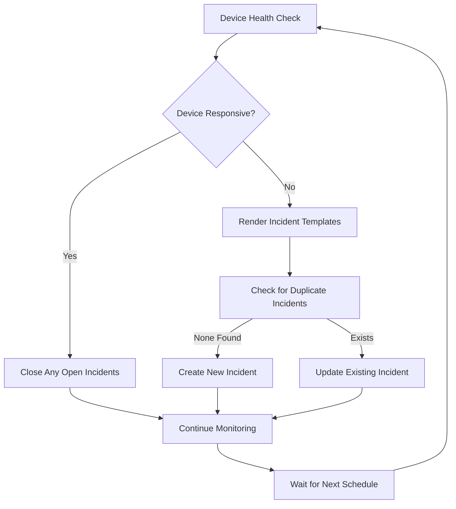

# Ansible ServiceNow Network Monitoring Integration

Automated network device monitoring with ServiceNow incident lifecycle management and systemd-based scheduling.

## Overview

This project provides a comprehensive solution for monitoring network infrastructure and automatically creating/managing ServiceNow incidents when issues are detected. It uses a factory pattern for automatic role discovery and systemd timers for reliable scheduling.

## Features

- **🔍 Automatic Device Monitoring**: Continuous health checks for network devices
- **📋 ServiceNow Integration**: Automatic incident creation, updates, and closure
- **🏭 Role Discovery Factory**: Automatically discovers and schedules monitoring roles
- **⏰ Systemd Scheduling**: Reliable, persistent timer-based execution
- **🔧 Template-Based**: Jinja2 templates for flexible incident content
- **🛡️ Duplicate Prevention**: Correlation-based incident deduplication
- **📊 CMDB Integration**: Automatic Configuration Item (CI) association

## Quick Start

### 1. Test the Monitoring System
```bash
# Test connectivity monitoring
ansible-playbook -i examples/inventory.yml test_failed_device.yml

# Test incident lifecycle (create and auto-close)
ansible-playbook -i examples/inventory.yml test_incident_lifecycle.yml

# Test change request creation
ansible-playbook -i examples/inventory.yml test_change_request.yml
```

### 2. Setup Automated Scheduling
```bash
# Discover available monitoring roles
cd scheduler/
python3 scheduler.py discover

# Create systemd timers (dry run first)
python3 scheduler.py create-timers --dry-run

# Install systemd timers for production
sudo python3 scheduler.py create-timers --inventory ../examples/inventory.yml

# Check service status
python3 scheduler.py status
```

### 3. Configure Your Environment
```bash
# Encrypt sensitive data
./encrypt_vault.sh

# Run production monitoring setup
./monitoring_setup.sh
```

## Architecture

### Core Components

```
ansible-servicenow/
├── roles/
│   ├── device_uptime/          # Network device monitoring role
│   └── servicenow_itsm/        # ServiceNow API wrapper role
├── scheduler/                  # Automated scheduling system
│   ├── scheduler.py            # Main orchestrator
│   ├── monitoring_role_factory.py  # Role discovery factory
│   └── templates/              # Systemd service templates
├── examples/                   # Sample configurations
├── tests/                      # Test playbooks
└── documentation/              # Additional documentation
```

### Design Patterns

1. **Factory Pattern**: Automatic role discovery and service generation
2. **Template Pattern**: Jinja2 templates for dynamic content generation
3. **Wrapper Pattern**: ServiceNow ITSM role abstracts API complexity
4. **Strategy Pattern**: Different monitoring strategies per device type

## Monitoring Roles

### How Monitoring Roles Work

Monitoring roles follow a standardized pattern:

1. **Health Check**: Execute monitoring logic (ping, SNMP, API calls)
2. **Template Rendering**: Generate incident content from Jinja2 templates
3. **ServiceNow Integration**: Call the ServiceNow ITSM wrapper role
4. **Lifecycle Management**: Handle incident creation, updates, and closure

### Existing Monitoring Roles

#### `device_uptime`
- **Purpose**: Network device connectivity monitoring
- **Schedule**: Every 5 minutes
- **Health Check**: ICMP ping with timeout
- **Incident Type**: Connectivity failures
- **Recovery**: Automatic incident closure when device responds

### Creating New Monitoring Roles

See [Creating New Monitoring Roles Guide](documentation/CREATE_NEW_ROLE.md) for detailed instructions.

#### Quick Example: Security Monitoring Role

1. **Create role structure**:
```bash
mkdir -p roles/security_scan/{defaults,tasks,templates,meta}
```

2. **Configure monitoring** (`roles/security_scan/defaults/main.yml`):
```yaml
---
# Security scan configuration
security_scan_timeout: 300
security_scan_ports: [22, 443, 80]

# Monitoring scheduler configuration  
monitoring_config:
  enabled: true
  role_type: security_monitoring
  default_schedule: "0 */6 * * *"  # Every 6 hours
  description: "Network device security scanning with vulnerability detection"
  inventory_groups:
    - network_devices
    - security_critical
  timeout: 600
  retry_count: 2
  playbook_args: "--limit={{inventory_group}} -e security_scan_timeout={{timeout}}"
```

3. **Implement monitoring logic** (`roles/security_scan/tasks/main.yml`):
```yaml
---
# Purpose: Network security scanning with ServiceNow integration
# Design Pattern: Security monitoring with vulnerability detection

- name: Security scan with incident lifecycle
  block:
    - name: Run security scan
      # Your security scanning logic here
      
    - name: Close security incidents if no issues found
      include_role:
        name: servicenow_itsm
        tasks_from: close_incident
      vars:
        incident_correlation_id: "security_scan_{{ inventory_hostname }}"
      when: security_scan_passed
      
  rescue:
    - name: Generate security incident content from templates
      set_fact:
        rendered_description: "{{ lookup('template', 'security_vulnerability_description.j2') }}"
        rendered_work_notes: "{{ lookup('template', 'security_vulnerability_work_notes.j2') }}"

    - name: Create ServiceNow incident for security issues
      include_role:
        name: servicenow_itsm
      vars:
        itsm_type: incident
        incident_caller: "{{ security_incident_caller | default(servicenow_default_caller) }}"
        incident_short_description: "[SECURITY] Vulnerability detected on {{ inventory_hostname }}"
        incident_description: "{{ rendered_description }}"
        incident_work_notes: "{{ rendered_work_notes }}"
        incident_correlation_id: "security_scan_{{ inventory_hostname }}"
        incident_urgency: high
        incident_impact: high
```

4. **Auto-discovery**: The scheduler factory will automatically discover and schedule your new role!

## ServiceNow ITSM Integration

### Supported ServiceNow Objects

The `servicenow_itsm` role supports multiple ServiceNow ITSM objects:

#### Incidents
```yaml
- include_role:
    name: servicenow_itsm
  vars:
    itsm_type: incident
    incident_caller: "admin"                    # Required
    incident_short_description: "Device down"  # Required
    incident_description: "{{ custom_desc }}"  # Optional
```

#### Change Requests
```yaml
- include_role:
    name: servicenow_itsm
  vars:
    itsm_type: change
    change_type: normal                         # standard|normal|emergency
    change_short_description: "Maintenance"    # Required
    change_description: "{{ custom_desc }}"    # Required
```

#### Problem Records
```yaml
- include_role:
    name: servicenow_itsm
  vars:
    itsm_type: problem
    problem_short_description: "Recurring issue" # Required
    problem_description: "{{ custom_desc }}"     # Required
```

### ServiceNow Field Requirements

**Required Fields:**
- **Incidents**: `incident_caller`, `incident_short_description`
- **Changes**: `change_type`, `change_short_description`, `change_description`
- **Problems**: `problem_short_description`, `problem_description`

**Optional Fields with Defaults:**
- `urgency`, `impact`, `priority`
- `assignment_group`, `category`, `subcategory`
- `work_notes`, `correlation_id`

See [ServiceNow Integration Guide](documentation/SERVICENOW_INTEGRATION.md) for complete field reference.

## Automated Scheduling System

The project includes a sophisticated scheduling system that automatically discovers monitoring roles and creates systemd timers.

### Scheduler Features

- **🔍 Automatic Discovery**: Finds monitoring roles without configuration
- **⚙️ Systemd Integration**: Generates proper service and timer files
- **🛡️ Security Hardening**: Isolated services with minimal privileges
- **📊 Status Monitoring**: Real-time service status and logging
- **🎯 Smart Naming**: Consistent systemd service naming conventions

### Scheduler Usage

```bash
# Discover monitoring roles
python3 scheduler.py discover

# Show detailed role summary
python3 scheduler.py summary

# Create systemd timers (dry run)
python3 scheduler.py create-timers --dry-run

# Install production timers
sudo python3 scheduler.py create-timers

# Monitor service status
python3 scheduler.py status
```

For detailed scheduler documentation, see: [Scheduler Documentation](scheduler/README.md)

## Configuration

### Inventory Configuration

Configure your network devices in `examples/inventory.yml`:

```yaml
all:
  children:
    network_devices:
      children:
        core_switches:
          hosts:
            core-sw-01:
              ansible_host: 10.1.1.1
              device_type: cisco_ios
              device_location: "Datacenter A"
              device_asset_tag: "P1000002"  # ServiceNow CI association
```

### ServiceNow Configuration

1. **Credentials** (in `group_vars/all/vault.yml`):
```yaml
---
vault_servicenow_host: "https://your-instance.service-now.com"
vault_servicenow_username: "your-username"
vault_servicenow_password: "your-password"
```

2. **Encrypt sensitive data**:
```bash
ansible-vault encrypt group_vars/all/vault.yml
```

## How It Works

### Device Monitoring Lifecycle



### Template-Based Content Generation

1. **Health Check Role** renders Jinja2 templates with monitoring data
2. **ServiceNow Role** receives pre-rendered content strings
3. **Templates** contain device-specific information and context
4. **Consistency** across incident creation and closure

### Duplicate Prevention

The system prevents duplicate incidents using correlation IDs:

- **Incident**: `device_connectivity_{{ inventory_hostname }}`
- **Change**: `device_maintenance_{{ inventory_hostname }}`
- **Problem**: `device_recurring_{{ inventory_hostname }}`

ServiceNow stores these correlation IDs and the system queries for existing records before creating new ones.

## Testing

### Unit Tests
```bash
# Test individual components
ansible-playbook test_connectivity.yml
ansible-playbook test_servicenow.yml
ansible-playbook test_asset_tag.yml
```

### Integration Tests
```bash
# Test complete incident lifecycle
ansible-playbook test_incident_lifecycle.yml

# Test change request workflow
ansible-playbook test_change_request.yml

# Test problem record creation
ansible-playbook test_problem_record.yml
```

### Validation Tests
```bash
# Test required field validation
ansible-playbook test_validation_error.yml
```

## Production Deployment

### Prerequisites

1. **System Requirements**:
   - Python 3.8+
   - Ansible 2.9+
   - ServiceNow ITSM Collection
   - systemd (for scheduling)

2. **ServiceNow Setup**:
   - Valid ServiceNow instance
   - User account with ITSM permissions
   - Configuration Items (CIs) for your devices

### Installation

1. **Clone and setup**:
```bash
git clone <repository>
cd ansible-servicenow
pip3 install -r requirements.txt
ansible-galaxy collection install servicenow.itsm
```

2. **Configure credentials**:
```bash
cp group_vars/all/vault.yml.example group_vars/all/vault.yml
# Edit with your ServiceNow credentials
ansible-vault encrypt group_vars/all/vault.yml
```

3. **Setup inventory**:
```bash
cp examples/inventory.yml inventory.yml
# Configure your devices
```

4. **Deploy monitoring**:
```bash
# Test configuration
python3 scheduler/scheduler.py create-timers --dry-run

# Deploy to production
sudo python3 scheduler/scheduler.py create-timers
```

### Monitoring and Maintenance

1. **Check service status**:
```bash
python3 scheduler/scheduler.py status
systemctl status device-uptime-monitor.timer
```

2. **View logs**:
```bash
tail -f /var/log/ansible-monitoring/device-uptime-monitor.log
journalctl -u device-uptime-monitor.service -f
```

3. **Update schedules**:
   - Modify role `defaults/main.yml`
   - Run `sudo python3 scheduler.py create-timers` to update

## Documentation

- [Creating New Monitoring Roles](documentation/CREATE_NEW_ROLE.md)
- [ServiceNow Integration Guide](documentation/SERVICENOW_INTEGRATION.md)
- [Scheduler Documentation](scheduler/README.md)
- [Template Development Guide](documentation/TEMPLATES.md)
- [Troubleshooting Guide](documentation/TROUBLESHOOTING.md)

## Security Considerations

- **Credential Management**: All passwords encrypted with ansible-vault
- **Service Isolation**: systemd services run with minimal privileges
- **Network Security**: API calls over HTTPS only
- **Access Control**: ServiceNow API user with minimal required permissions
- **Audit Logging**: All operations logged for compliance

## Contributing

1. Fork the repository
2. Create a feature branch
3. Add monitoring role following the established patterns
4. Update documentation
5. Submit a pull request

## License

This project is licensed under the MIT License - see the [LICENSE](LICENSE) file for details.

## Support

For questions and support:
- Review the [Troubleshooting Guide](documentation/TROUBLESHOOTING.md)
- Check existing [Issues](../../issues)
- Create a new issue with detailed information

## Changelog

See [CHANGELOG.md](CHANGELOG.md) for version history and updates.